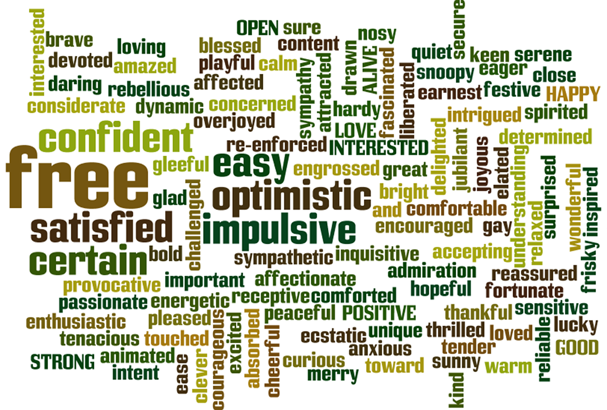

# SMS Spam Detection Project

This project focuses on building a robust SMS spam detection system utilizing custom implementations of essential components, namely, the CountVectorizer and NaiveBayes algorithms. Unlike traditional implementations using sklearn modules, this project emphasizes a personalized approach for feature extraction and classification.

## Key Features

- **Custom CountVectorizer:** A specialized implementation for transforming SMS messages into numerical feature vectors, capturing the frequency of each word in the dataset.

- **Custom NaiveBayes Classifier:** A bespoke NaiveBayes classifier designed for text classification. The model is trained on a labeled dataset of SMS messages to discern patterns indicative of spam or non-spam content.

## Modules

### Vectorizer

- [CountVectorizer](https://github.com/rashidkhanrk06/txt_vectorizer.git): This custom implementation efficiently converts SMS text into a format suitable for machine learning models, offering a tailored solution for feature extraction.

- [TFIDFVectorizer](https://github.com/rashidkhanrk06/txt_vectorizer.git): In addition to CountVectorizer, a TFIDFVectorizer class is provided for term frequency-inverse document frequency (TF-IDF) feature extraction, enhancing the flexibility of the project.

### NaiveBayes

- [GaussianNB](https://github.com/rashidkhanrk06/naiveBayes.git): A Gaussian NaiveBayes class is included, extending the application to scenarios where features follow a Gaussian distribution.

- [CategoricalNB](https://github.com/rashidkhanrk06/naiveBayes.git): The CategoricalNB class facilitates NaiveBayes classification with categorical features, broadening the applicability of the system.

- [NaiveBayes](https://github.com/rashidkhanrk06/naiveBayes.git): This generic NaiveBayes class serves as the backbone of the system, providing a customizable framework for training and predicting using Naive Bayes algorithms.

## Dataset

The project employs the SMS Spam Collection dataset, a well-known dataset for spam detection tasks. Details about the dataset can be found [here](https://archive.ics.uci.edu/ml/datasets/sms+spam+collection).

## Results

Following training and evaluation, the model exhibits an accuracy of approximately 97.25%.

